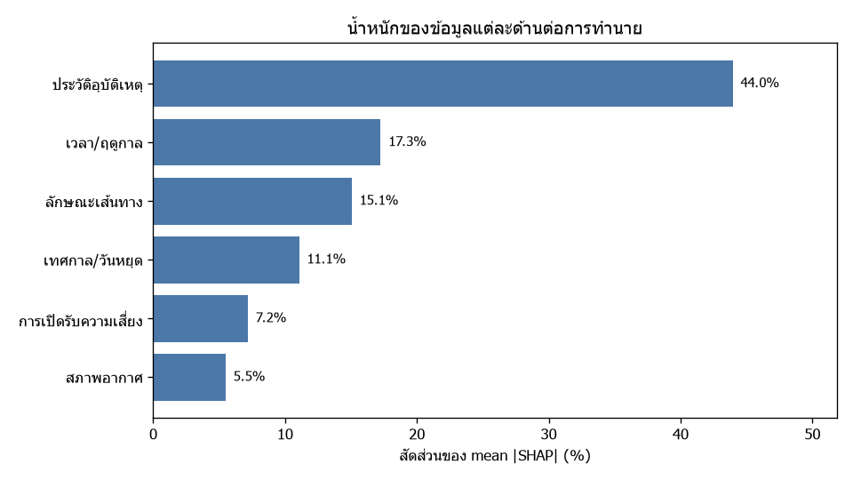
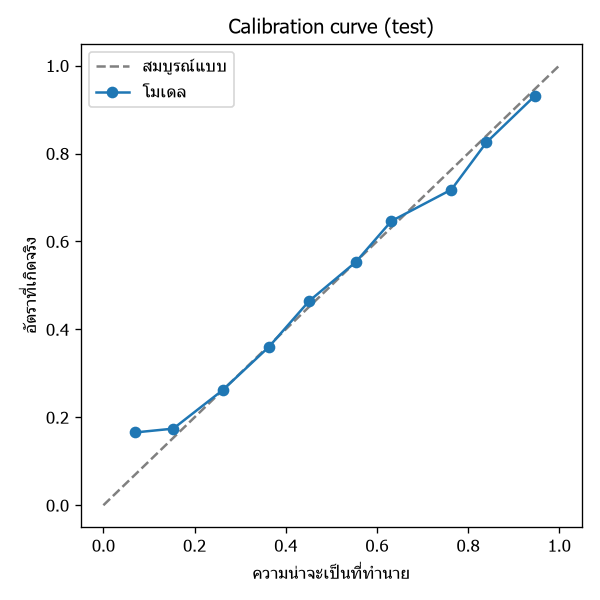
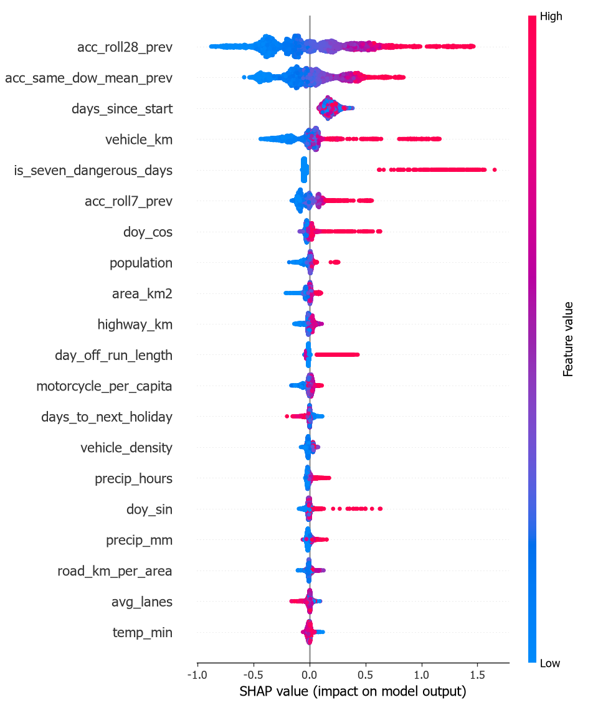
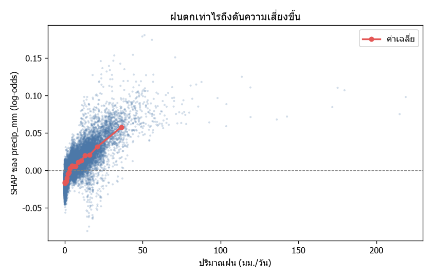
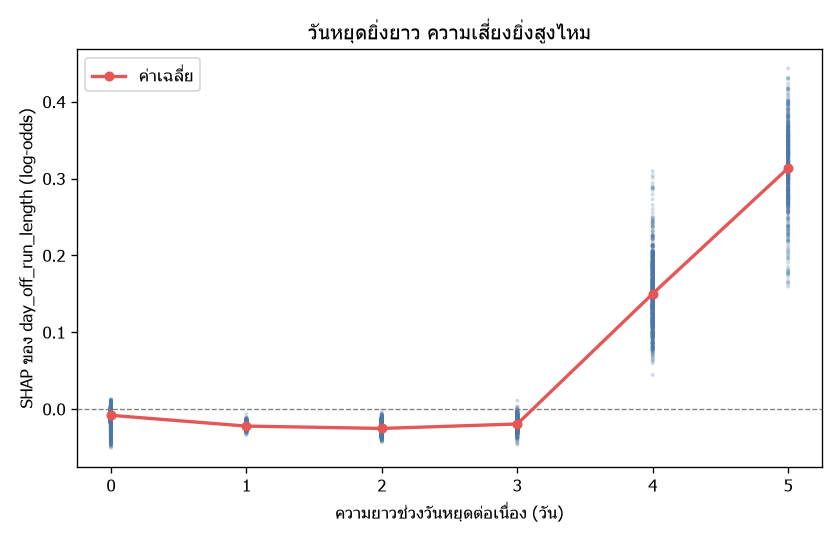

<div align="center">


# 🚨 RoadWarn

### เว็บแอปเตือนภัยบนท้องถนนแบบเรียลไทม์ พร้อมแผนที่ 3 มิติ

**ผลงานสำหรับ CDG Hackathon 2026 — โจทย์ “AI for a Better Society Platform”**

[](#)
[](#)
[](#)
[](#)


[](https://canva.link/iy2q5awn2gy1usm)


`#CDGHackathon2026`

</div>

---

## RoadWarn คืออะไร

เว็บแอปแจ้งเตือนภัยบนถนนแบบเรียลไทม์ พร้อมแผนที่ 3 มิติ (มุมกล้องเอียง อาคารสามมิติ ภูมิประเทศ
และท้องฟ้าไล่เฉด) ทำงานเป็นเว็บสแตติกล้วน ไม่ต้องมี backend และ **ไม่ต้องใช้ API key ใด ๆ**

แอปตอบคำถามสองข้อที่อยู่คนละแกนกัน แล้วเอามารวมกัน

| | ตอบว่า | มาจาก |
|---|---|---|
| 📍 **รายงานจากผู้ใช้** | **ตรงไหน** อันตราย | คนแจ้งเหตุ ณ ตอนนี้ |
| 🤖 **โมเดลพยากรณ์** | **วันไหน** อันตราย | สถิติอุบัติเหตุ 4 ปี + อากาศ + ปฏิทินวันหยุด |

## ฟีเจอร์หลัก

- **แผนที่ 3 มิติ ธีมมืด** — กล้องเอียง อาคาร fill-extrusion ภูมิประเทศจาก DEM สลับเป็นดาวเทียมได้
- **หมุดเตือนภัย 9 ประเภท** — อุบัติเหตุ น้ำท่วม ก่อสร้าง หลุมบ่อ สิ่งกีดขวาง รถติด ด่านตรวจ
  ทัศนวิสัยต่ำ สัตว์บนถนน แต่ละจุดมีวงรัศมีเตือน
- **แผ่นสรุปการเดินทางก่อนออกรถ** — บอกเวลา ระยะทาง และ **ความเสี่ยงเฉพาะถนนที่เส้นทางนั้นวิ่งผ่าน**
  เลือกได้ว่าไปด้วยรถยนต์หรือมอเตอร์ไซค์
- **เปรียบเทียบเส้นทางเพื่อเลี่ยงจุดเสี่ยง** — ให้คะแนนเส้นทางสำรองทีละเส้น แล้วชี้ว่าเส้นไหน
  ปลอดภัยกว่าและแลกกับเวลาเท่าไร **ผู้ใช้เป็นคนเลือกเอง ระบบไม่เปลี่ยนให้เงียบ ๆ**
- **เส้นทางระบายสีตามความเสี่ยง** — ช่วงถนนที่อันตรายเปลี่ยนเป็นสีส้ม/แดง
- **แจ้งเตือนอัตโนมัติระหว่างขับ** — เมื่อภัยอยู่ข้างหน้า (±100°, ระยะ ~900 ม.) จะขึ้นแบนเนอร์
  \+ เสียงเตือน + อ่านออกเสียงภาษาไทย + สั่น และไม่เตือนซ้ำจุดเดิมภายใน 5 นาที
- **จุดเสี่ยงจริง 3,000 จุด** — คำนวณจากอุบัติเหตุจริง 100,056 เหตุการณ์ ปี 2565–2569
- **แจ้งเหตุเอง + โหวตยืนยัน/ปฏิเสธ** — รายงานหมดอายุอัตโนมัติหลัง 12 ชั่วโมง
- **โหมดจำลองการขับ** — จัดฉากสาธิตให้ครบพร้อมนำเสนอ ล้างทิ้งทันทีที่ปิดโหมด

## การทำงานหลัก — คะแนนความเสี่ยงคิดจากอะไร

**เราไม่ได้คำนวณเส้นทางเอง** OSRM เป็นคนหาเส้นทางให้ แล้วเราแปลง maneuver เป็นภาษาไทย
สิ่งที่เป็นของเราจริง ๆ คือ**ชั้นความเสี่ยงที่ทับลงไป** ใน [`js/risk.js`](js/risk.js)

```
1. จับจุดเสี่ยงเข้ากับเส้นทาง   เก็บเฉพาะจุดที่ห่างจากเส้นทางไม่เกิน 120 ม.
                                (เพื่อไม่ให้ถนนคู่ขนานปนเข้ามา)

2. ให้น้ำหนักแต่ละรายงาน        ความรุนแรง × ความน่าเชื่อถือ(โหวต) × ความสด
                                สดใหม่ = 1.0 · 3 ชม. ≈ 0.55 · ครบ 12 ชม. ≈ 0.31

3. คะแนนรายถนน                  รวมน้ำหนัก + อุบัติเหตุคูณพิเศษ 1.5
                                แล้วบีบเข้าช่วง 0–100

4. คะแนนรวมเส้นทาง              ความหนาแน่นของจุดเสี่ยงต่อ 10 กม.
                                (หารด้วยระยะทาง ถนนสายยาวจึงไม่เสียเปรียบ)

5. คูณโปรไฟล์พาหนะ              มอเตอร์ไซค์ เสี่ยง ×1.8 · เวลา ×0.85

6. เสนอทางเลี่ยง                เฉพาะเมื่อปลอดภัยกว่าเกิน 15 แต้ม
                                และช้ากว่าไม่เกิน 20%
```

**สองการตัดสินใจที่ตั้งใจทำ**

- **ไม่เปลี่ยนเส้นทางให้เองเงียบ ๆ** คืนแค่ "ข้อเสนอ" ให้ผู้ใช้เลือก เพราะคะแนนความเสี่ยง
  ยังเป็นค่าประมาณ การบังคับให้คนอ้อมไปหลายกิโลด้วยตัวเลขที่ยังไม่ได้พิสูจน์นั้นหนักเกินไป
- **ตัดด่านตรวจออกจากการคิดทางเลี่ยง** — ด่านตรวจไม่ใช่อันตรายบนถนน และการช่วยให้คนขับ
  เลี่ยงด่านวัดแอลกอฮอล์ขัดกับเป้าหมายลดอุบัติเหตุโดยตรง (ยังแสดงหมุดและยังเตือนตอนใกล้ถึง)

## เทคโนโลยีที่ใช้

| ส่วน | ใช้อะไร |
|---|---|
| **ฝั่งเว็บ** | JavaScript ES2020 (vanilla, ไม่มี framework) · HTML5 · CSS · **MapLibre GL JS 5.6.0** |
| **แผนที่ / นำทาง** | **OSRM** (เส้นทาง) · **Nominatim** (ค้นหา) · **OpenFreeMap** (tiles) · AWS Terrain Tiles · Esri World Imagery |
| **Web API** | Geolocation · Speech Synthesis (เสียงพูดไทย) · Web Audio · Vibration · localStorage |
| **AI Pipeline** | **Python** + **XGBoost** / LightGBM / SHAP / pandas / scikit-learn · **Node.js 20+** · Overpass API |
| **แหล่งข้อมูล** | กระทรวงคมนาคม · RTDDI (data.go.th) · ThaiRSC · Open-Meteo · ปฏิทินวันหยุดไทย |

> **ไลบรารีที่โหลดตอนรันจริงมีตัวเดียว** คือ MapLibre GL JS
> นอกนั้นเป็นโค้ดที่เขียนเองทั้งหมด ~12,000 บรรทัด · ไม่มี bundler · ไม่ต้องใช้ API key สักตัว

## วิธีรัน

```bash
python3 -m http.server 8080
# เปิด http://localhost:8080
```

ต้องเสิร์ฟผ่าน HTTP (ไม่ใช่ `file://`) เพราะเบราว์เซอร์ไม่ให้ใช้ Geolocation บนโปรโตคอล
ที่ไม่ปลอดภัย — `localhost` ถือว่าปลอดภัยแล้ว ถ้าขึ้น production ต้องใช้ HTTPS

บน Windows ที่ไม่มี Python/Node ใช้ `powershell -ExecutionPolicy Bypass -File tools/serve.ps1`

## โครงสร้างไฟล์

```
index.html          โครงหน้าจอทั้งหมด
css/style.css       ธีมมืด แผ่นรายการแบบลากได้ เลย์เอาต์มือถือ

js/config.js        ประเภทภัย ระดับความรุนแรง ค่าเริ่มต้นแผนที่ และ URL ของ tile
js/utils.js         คำนวณระยะทาง/ทิศทาง/วงกลม GeoJSON
js/geocode.js       ค้นหาสถานที่และแปลงพิกัดเป็นชื่อถนน ผ่าน Nominatim
js/route.js         ขอเส้นทางจาก OSRM และแปลงคำสั่งเลี้ยวเป็นภาษาไทย
js/store.js         คลังข้อมูลรายงาน + คะแนนความเสี่ยง + localStorage (pub/sub)
js/risk.js          ⭐ ความเสี่ยงรายเส้นทาง — หัวใจของแอป
js/map.js           แผนที่ 3 มิติ หมุด วงรัศมีเตือน และการควบคุมกล้อง
js/alerts.js        ติดตาม GPS ตรวจภัยข้างหน้า เสียง/เสียงพูด/สั่น
js/navigate.js      โหมดนำทาง คำนวณเส้นทางใหม่ เตือนจุดเสี่ยงบนเส้นทาง
js/ui.js            แผ่นรายการ ตัวกรอง ค้นหา ฟอร์มแจ้งเหตุ
js/app.js           ประกอบทุกส่วนเข้าด้วยกัน

js/ai-model.js      รันโมเดล XGBoost ที่เทรนไว้ (เดินต้นไม้ในเบราว์เซอร์)
js/ai-forecast.js   ดึงพยากรณ์อากาศ ประกอบ feature แล้วทำนายรายจังหวัด × วัน
js/hotspots.js      ชั้นจุดเสี่ยงจริงบนแผนที่ (3,000 จุด)

data/ai/            โมเดล + ข้อมูลประกอบ (JSON ธรรมดา)
ai-pipeline/        ตัวดึงข้อมูล + เทรนโมเดล (ใช้เฉพาะตอนอยากอัปเดตโมเดล)
```

การไหลของข้อมูลเป็นทางเดียว — ทุกการเปลี่ยนแปลงเข้า `Store` → `Store` ส่งสัญญาณออก →
`app.js` สั่งให้ `MapView` และ `UI` วาดใหม่ ไม่มีส่วนไหนแก้ DOM ข้ามกันเอง

**ถ้าจะแค่รันเว็บ ไม่ต้องแตะ `ai-pipeline/` เลย** โมเดลที่เทรนเสร็จแล้วอยู่ใน `data/ai/`
เป็น JSON ธรรมดา `git clone` แล้วเสิร์ฟได้ทันที

## โมเดลพยากรณ์ความเสี่ยงรายวัน

โมเดล **XGBoost** เทรนจากสถิติอุบัติเหตุจริงบนโครงข่ายถนนกระทรวงคมนาคม ปี 2565–2569
ระดับ **จังหวัด × วัน** (121,737 แถว) รวมกับพยากรณ์อากาศและปฏิทินวันหยุด
เพื่อตอบคำถามที่รายงานจากคนตอบไม่ได้ — **"วันนี้เป็นวันแบบไหน"**

**รันในเบราว์เซอร์ทั้งหมด** ต้นไม้ถูกแปลงเป็น JSON แล้ว `js/ai-model.js` เดินต้นไม้เอง (~40 บรรทัด)
จึงไม่ต้องมี backend และยังวางบน GitHub Pages ได้

### ผลการเทรน

แบ่งตามเวลา ไม่ shuffle เพราะเป็นอนุกรมเวลา — train 2565–2566 / valid 2567 / **test 2568** / holdout 2569

| ชุด test (n=28,105 · วันที่เกิดเหตุจริง 43.7%) | โมเดล | baseline |
|---|---|---|
| ROC-AUC | **0.744** | — |
| PR-AUC | **0.713** | 0.674 |
| F1 @0.32 | **0.658** | 0.547 |
| Brier (ต่ำ=ดี) | 0.200 | — |

holdout ปี 2569 ได้ F1 **0.680** / PR-AUC **0.741** ซึ่งไม่ต่ำกว่า test — โมเดลไม่ได้ overfit ช่วงเวลาใด

> **อ่านตัวเลขนี้อย่างไรให้ไม่หลงตัวเอง** — accuracy 69% ฟังดูดี แต่ถ้าเดา "ไม่เกิด" ทุกวัน
> จะได้ 56.3% อยู่แล้ว ตัวที่ควรดูคือ PR-AUC 0.713 เทียบ baseline 0.674 — ชนะจริงแต่ไม่ขาด

<div align="center">

| น้ำหนักของข้อมูลแต่ละกลุ่ม | ความแม่นของความน่าจะเป็น |
|:---:|:---:|
|  |  |
| วัดด้วย mean \|SHAP\| — ประวัติอุบัติเหตุมีน้ำหนักมากที่สุด | เส้นยิ่งใกล้แนวทแยง แปลว่า "70%" ที่โมเดลบอกคือ 70% จริง |

</div>

<details>
<summary><b>ดูภาพวิเคราะห์เพิ่มเติม</b></summary>

<br>

<div align="center">



| ฝนมีผลอย่างไร | เทศกาลมีผลอย่างไร |
|:---:|:---:|
|  |  |

</div>

</details>

ตัวรันฝั่งเบราว์เซอร์ถูกตรวจว่าให้ผลเท่ากับ XGBoost ฝั่ง Python บน 60 เคส ส่วนต่างสูงสุด **1.4e-7**

## ข้อจำกัดของต้นแบบนี้

เขียนไว้ตรง ๆ เพราะต้นแบบที่ไม่บอกข้อจำกัดคือต้นแบบที่เชื่อไม่ได้

- **ข้อมูลเก็บใน `localStorage` เท่านั้น** ยังไม่แชร์ระหว่างผู้ใช้จริง — ขั้นถัดไปคือต่อ backend
  แล้วเปลี่ยนเฉพาะใน `js/store.js`
- **กราฟ "อัตราการเกิดอุบัติเหตุที่ลดลง" เป็นข้อมูลสาธิต** เพราะยังไม่มีสถิติย้อนหลังจริงให้คำนวณ
  (หน้าจอกำกับไว้ชัดเจน)
- **เวลาเดินทางเป็นเวลาแบบถนนโล่ง** เพราะ OSRM ไม่มีข้อมูลจราจรสด และเส้นสีบนเส้นทาง
  หมายถึง "ความเสี่ยง" ไม่ใช่ "รถติด"
- **โมเดลเป็นความเสี่ยงระดับจังหวัด ไม่ใช่ของถนนเส้นที่คุณจะขับ** และเทรนจากอุบัติเหตุบนทางหลวง
  เท่านั้น ไม่รวมถนนในเมืองและซอย (ครอบคลุมราว 15% ของการเสียชีวิตบนถนนทั้งประเทศ)
- **จุดเสี่ยงบนแผนที่คือสถิติย้อนหลัง ไม่ใช่เหตุที่กำลังเกิด**
- ตัวคูณความเสี่ยงมอเตอร์ไซค์ (1.8) เป็นค่าประมาณเพื่อการเตือน ไม่ใช่ตัวเลขทางสถิติที่อ้างอิงได้
- ตัวเลขจากโมเดลบอก **ความสัมพันธ์ ไม่ใช่สาเหตุ** ใช้เป็นตัวช่วยตัดสินใจ ไม่ใช่คำรับประกัน

## แผนพัฒนาต่อ

| # | สิ่งที่จะทำ | ทำไม |
|:---:|---|---|
| 1 | **Backend + ระบบยืนยันความน่าเชื่อถือ** | แอป crowdsource ที่ไม่แชร์ข้อมูลยังไม่ใช่แอป crowdsource ต้องมาพร้อม rate limit และการถ่วงน้ำหนักตามประวัติคนแจ้ง |
| 2 | **ย้าย routing ไป Valhalla** | ปรับ cost รายถนนได้ ทำให้ความเสี่ยงเป็นตัวแปรในการหาเส้นทางตั้งแต่แรก ไม่ใช่คำเตือนที่มาทีหลัง |
| 3 | **เริ่มจาก B2B** | ฟลีตขนส่ง/เดลิเวอรี่ที่มีมอเตอร์ไซค์ — เรามีโปรไฟล์ความเสี่ยงมอเตอร์ไซค์อยู่แล้ว และข้อมูลการขับจะไหลกลับมาเทรนโมเดล |

---

<div align="center">

**CDG Hackathon 2026 · AI for a Better Society Platform**

`#CDGHackathon2026`

</div>
